# Sarah Spence: Software Engineer

## Code Review

<iframe width="560" height="315" src="https://www.youtube.com/embed/ScKbzAVPAAM" title="YouTube video player" frameborder="0" allow="accelerometer; autoplay; clipboard-write; encrypted-media; gyroscope; picture-in-picture" allowfullscreen></iframe>

## Artifact One: Search and Rescue Animal Full-Stack Application

[Orginal Project Code](https://github.com/S-Spence/Rescue_Animal_Search_Dashboard "Rescue Animal Project")

[Enhanced Project Code](https://github.com/S-Spence/Rescue_Animal_Capstone_Project "Rescue Animal Capstone Project")

### Description

A full-stack program designed to manage search and rescue animals for Grazioso Salvare demonstrates competencies in software design and engineering, and databases. This program was the final project for a Client/Server Development course at Southern New Hampshire University. The project utilized MongoDB for the database, PyMongo for the middleware, and Dash for the user interface. The artifact allows Grazioso Salvare’s staff to filter rescue animals by compatible rescue types, including water, mountain, and disaster rescues. The project also included unit tests for the CRUD module. The program did not allow users to update animal information, reserve animals for a search mission, intake an animal, or remove an animal from the database. I incorporated several enhancements to this project outlined below. 

### Inclusion and Enhancements

I selected the search and rescue animal application to broaden my skill set as a full-stack developer. I introduced three new features to help Grazioso Salvare’s staff manage the database. These improvements applied to the software design and engineering category of my portfolio. These enhancements demonstrate my ability to plan project improvements to meet user requirements. I included a use case diagram for the application below to outline the program’s desired functionality. 

<h4 align="center">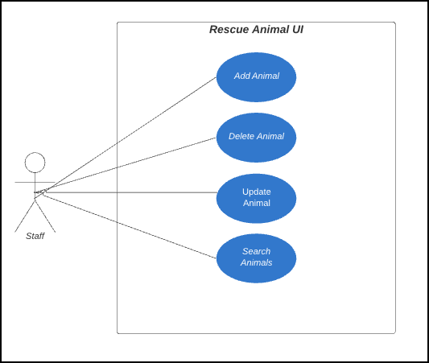</h4> 

I researched and selected my development tools during the project’s design phase. I chose a MERN stack because it is a popular and scalable full-stack environment (MongoDB, 2021). The MERN stack uses MongoDB, Express, React, and Node.JS as its primary technologies. However, I added additional technologies for backend testing, such as Jest and Mongo Memory Server. I also included the ag-grid module and bootstrap for frontend styling. Researching these technologies gave me a deeper understanding of web development and how the pieces of full-stack applications interact. 

I began enhancements for this project by reinitializing the database in Mongo Atlas. The database was originally in a virtual lab environment provided by my university. Mongo Atlas allowed the node development server to interact with the database in the cloud. This program is an internal application to help non-technical staff manage the database, and it does not include a log-in feature. However, the default account follows the principle of least privilege and only has access to the animal collection. I also cleaned up the database by removing redundant fields and renaming variables to follow consistent naming conventions. Finally, I added variables to store image URLs and set the reserved status for search and rescue animals. These enhancements taught me how to work with Mongo Atlas from the mongo shell to manage my database. The images below show the improvements to the database schema.  

<h4 align="center">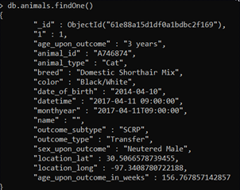</h4> 
<h4 align="center">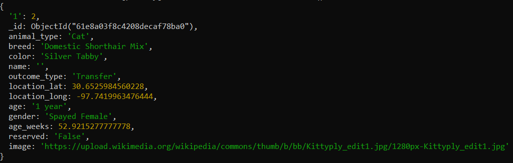</h4> 

Next, I developed middleware to update, delete, create, and search for rescue animals using Node.JS and Express. I structured the project into frontend and backend folders to manage the development server, middleware, and user interface. I used Jest and Mongo Memory Server for endpoint testing. I had no experience with Node or Express before working on these enhancements. I learned that Node is a powerful development tool that can guide many personal and professional projects in the future. I also gained experience with testing frameworks for full-stack development.

<h4 align="center">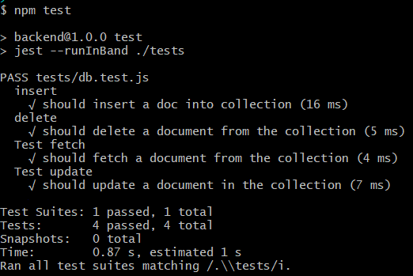</h4> 

Finally, I developed the user interface to interact with my middleware using React and CSS. I displayed the search and rescue dogs on cards in a grid layout with the animal’s images to make the interface more visually appealing. Users can edit the animal’s information to reserve them for rescue missions from the card’s edit button. I also included a table to view and filter all shelter animals using the ag-grid module. However, the table does not contain edit and delete functionalities since this platform only manages the search and rescue dogs.  

Next, I developed the forms to add and edit search and rescue animals. I incorporated input validation to enhance security. I also developed an interactive navigation bar by adding a drop-down menu with filters for the different search and rescue types. The drop-down items change colors when hovering over selections. The navigation also includes links to view all shelter animals and intake animals. I included media queries to alter the display of the navigation element on smaller screens. These enhancements demonstrate my ability to develop responsive user interfaces for database management. The images below show samples of the user interface. 

<h4 align="center">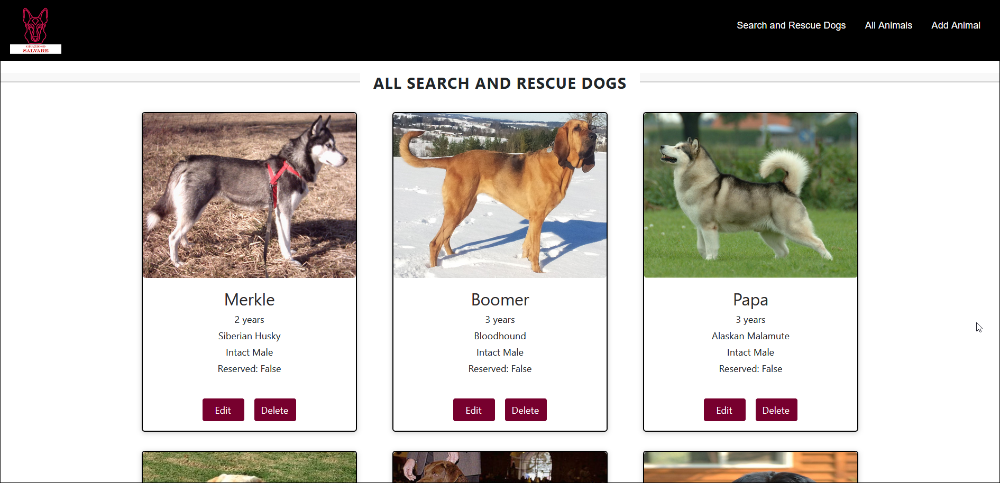</h4> 
<h4 align="center">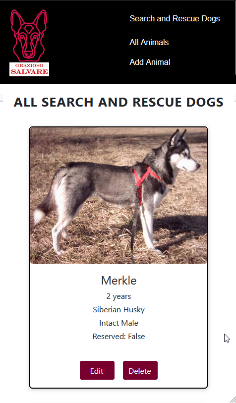</h4> 
<h4 align="center">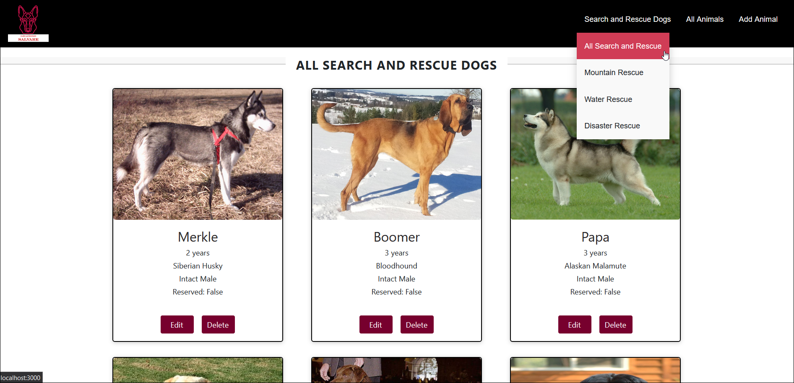</h4> 
<h4 align="center">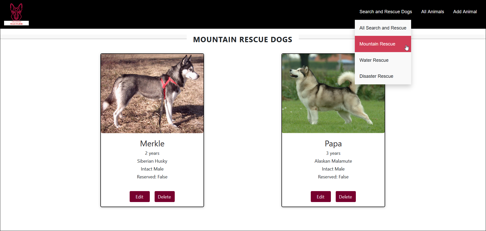</h4>
<h4 align="center">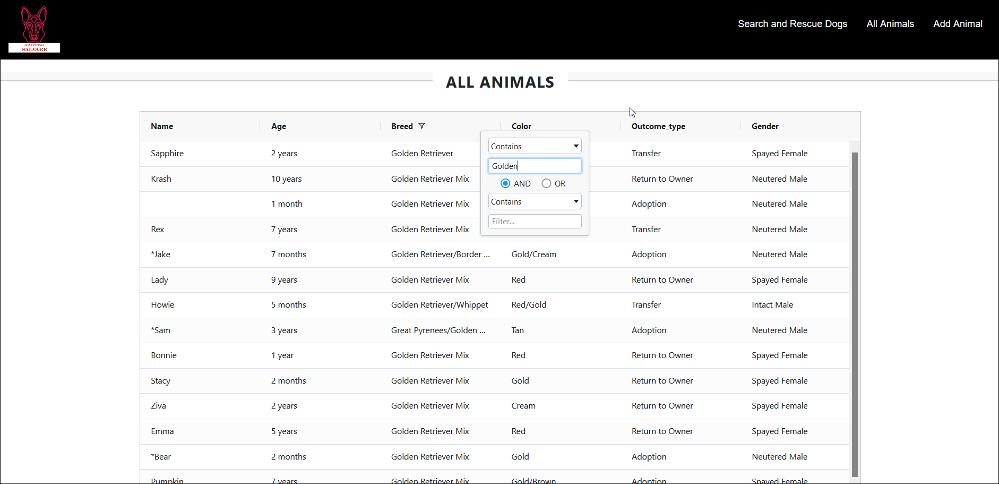</h4>

  

    <h4 align="left">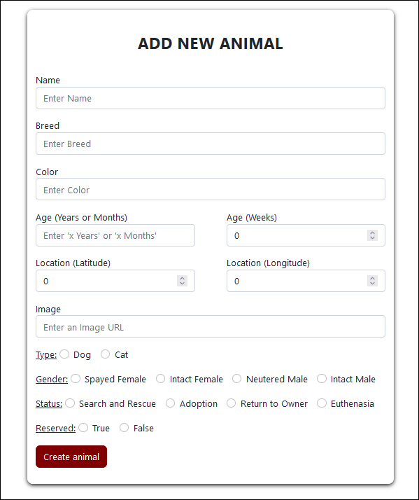</h4>
  

  

    <h4 align="right">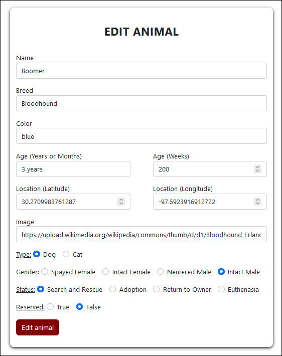</h4>
  

I met all planned enhancements outlined in the project proposal and code review. These enhancements align with the course outcome [CS-499-01] “Employ strategies for building collaborative environments that enable diverse audiences to support organizational decision making in the field of computer science” (Southern New Hampshire University, 2021). These enhancements also align with the course outcome [CS-499-04] “Demonstrate an ability to use well-founded and innovative techniques, skills, and tools in computing practices for the purpose of implementing computer solutions that deliver value and accomplish industry-specific goals” (Southern New Hampshire University, 2021). This project also met the security competency for the course by incorporating the principle of least privilege in database design and adding automated testing. Furthermore, the code review and project narrative gave me experience communicating design designs to project stakeholders. 

### Reflection

I improved this artifact by converting it to a more popular and versatile full-stack framework. This experience measuring trade-offs between technology selections will be valuable to my future career as a software developer. I faced several challenges initializing my MERN stack because I had limited experience with these technologies. I found a tutorial in MongoDB’s documentation that helped tremendously. This tutorial filled my knowledge gaps and helped me quickly connect the project’s pieces using a Node module called MongoDB (MongoDB, 2021). I also faced some challenges incorporating testing because I had never used the Jest testing framework. I found a guide for database testing with Jest for MongoDB that helped me set up a Mongo Memory Server to mimic my database in memory rather than testing on the live database (NPM, 2022). These enhancements provided a valuable learning experience because they were challenging and gave me more experience developing and testing full-stack applications.

The hurdles I faced developing the frontend were styling the responsive search grid and incorporating media queries. The MDN Web Docs for frontend development helped with the user interface because I had minimal experience in this area (MDN, 2022). The CSS documentation guided element styling for my project. I used bootstrap to style the form elements. I also used the ag-grid package for React to develop the interactive table for all shelter animals. This project made me more comfortable with CSS and media queries. The rescue animal application gave me full control of project development from the design phase. My experiences designing and developing this project sharpened my software engineering skills and gave me experience with in-demand technologies.    

## Artifact Two: Data Structures and Algorithms

[Data Structure and Algorithm Repository](https://github.com/S-Spence/Data_Structures_and_Algorithms "Data Strcutures and Algorithms")

### Description

This project stores data structure and algorithm practice scripts for interview preparation. I began working on this repository in January of 2021. However, I started actively contributing to this repository in August of 2021, when I became more active in my job search. The project contains the following sections outlining my experience with data structures and algorithms. 

- 2D Arrays
- Linked Lists
- Recursion and Dynamic Programming
- Sorting and Searching
- Stacks and Queue
- String and Arrays
- Trees, Graphs, and Tries
- Other (design questions)

These sections contain coding challenges from various sources, such as Leetcode, Hackerrank, Udemy courses, and Cracking the Coding Interview by Gayle Laakmann McDowell. The practice scripts include unit tests and an analysis of the time and space trade-offs between the solutions. Therefore, this repository demonstrates my understanding of data structure selection and code optimization techniques.

### Inclusion and Enhancements

I selected this artifact for the data structures and algorithms enhancement because it contains all types of data structures and some complex algorithms that I have practiced in my free time. I also included unit tests throughout the repository to demonstrate my skills with software testing. This repository consists of easy to hard-level coding challenges. The first version of the project had some structural inconsistencies and some missing tests. The dynamic programming, 2D arrays, and trees\graphs\tries folders did not have much depth in the first version of the project. 

I made several enhancements to this repository. First, I fixed the structural issues within the codebase by making all files consistent with comments, naming conventions, and testing techniques. Next, I added twelve new challenges to the repository practicing graphs, tries, 2D arrays, and dynamic programming. I enjoyed working with graphs in the “course scheduler” and “network time delay” challenges. I also enjoyed gaining more experience with tries. 

This artifact met all enhancements discussed in the project proposal and code review. I added the unit tests to the linked list folder. The only alteration I made to my plan in this section was to leave the manual tests for the “merge multi-level linked lists” challenge. This challenge came from an Udemy course that provided some great test methods to visualize the multi-level linked list before and after flattening. These testing methods helped explain the problem and seemed more valuable than unit tests. I cited the author of the test functions in the code comments. The image below demonstrates the manual tests for the multi-level linked list challenge.

<h4 align="center">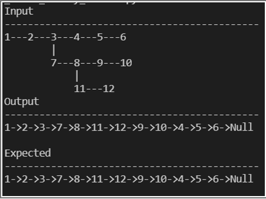</h4> 

I also fixed the structural inconsistencies in the strings and arrays folder outlined in the code review. I updated the ‘binary string consecutive ones,” “max hour-glass sum,” and “ransom note” challenges to have consistent styling and testing with the rest of the folder. I also updated tests and comments in the “implement queue with stacks” and “LRU cache” challenges. Another enhancement for this project was adding twelve more challenges for 2D arrays, graphs, tries, and dynamic programming. I outlined the challenges added to each of the sections below.

**Dynamic Programming:** 
- **Knight Probability Challenge:** On a given n x n chessboard, a knight will start at the rth row and cth column. A knight can move in eight possible ways. Each move will choose one of these eight at random. The knight continues moving until it finishes k moves or moves off the chessboard. Return the probability that the knight is on the chessboard after it finishes moving.
- **Minimum Cost of Climbing Stairs Challenge:**  For a given staircase, the ith step is assigned a non-negative cost indicated by a cost array. After paying the cost for a step, you can either climb one or two steps. Find the minimum cost to reach the top of the staircase.
- **Palindrome Substring:** Find the longest palindromic substring in a string.

**2D Arrays:**
- **Rotting Oranges:** You are given an array containing 0s (empty cells), 1s (oranges), and 2s (rotting oranges). Every minute, all fresh oranges immediately adjacent to rotting oranges rot. How many minutes will pass before all oranges are rotten?
- **Rotate Matrix 90 Degrees:** Rotate a matrix 90 degrees clockwise. Follow-up: rotate counter-clockwise. 
- **Set Matrix Zeros:** Given an m x n integer matrix, if an element is zero, set its entire row and column to zeros in place and return the matrix.
- **Spiral Matrix:** Given an integer matrix, print its elements in spiral order.
- **Wall and Gates:** Given a 2D array containing -1s (walls), 0s (gates), and INFs (empty rooms), fill each empty room with the number of steps to the nearest gate. If it is not possible to reach a gate, leave INF as the value.

**Graphs and Tries:**
- **Prefix Trie:** Implement a trie with insert, search, and starts_with methods. 
- **Time Needed to Inform Employees:** A company has n employees with unique IDs from 0 to n-1. The head of the company has the ID headID. You will receive a manger’s array where mangers[i] is the ID of the manager for employee i. Each employee has one direct manager. The company head has no manager, and the ID is set to -1. It is guaranteed that subordination relationships will have a tree structure. The head of the company wants to inform all employees of the news. He will inform his direct subordinates, who will inform their direct subordinates, etc. You will also receive an inform time array, where inform_time[i] is the time it takes employee i to inform all subordinates. Return the total number of minutes it takes to inform all employees of the news.
- **Network Time Delay:** There are n network nodes labeled 1 to n. You are given a times array containing edges represented by arrays [u, v, w], where u is the source node, v is the target node, and w is the time taken to travel between nodes. Send a signal from node k and return the time it takes for all nodes the receive the signal. Return -1 if it is impossible.
- **Course Scheduler:** There are a total of n courses to take, labeled from 0 to n-1. Some courses have prerequisite courses. This is expressed as a pair, i.e. [0, 1], to indicate you must take course 0 before course 1. Given the total number of courses and an array of prerequisite pairs, return if it is possible to finish all courses.  

Several of these scripts incorporated multiple solutions to evaluate the trade-offs between time and space when selecting data structures and algorithms. Therefore, this artifact met the course outcome [CS-499-03] “design and evaluate computing solutions that solve a given problem using algorithmic principles and computer science practices and standards appropriate to its solution while managing the trade-offs involved in design choices” (Southern New Hampshire University, 2021). Enhancing this project for my computer science capstone made me more confident for coding interviews. 

### Reflection

Enhancing the data structures and algorithms repository was a valuable learning experience. I faced some challenges understanding how to work with graphs at first. At first, it was challenging to understand the use cases for adjacency arrays and adjacency matrices when representing graphs. I learned from an interview preparation class on Udemy that adjacency arrays are generally better than adjacency matrices unless the graph is close to complete or contains cycles (Neagoie, 2021). I also found it challenging to identify graph challenges since these questions do not specify when a graph may help. I now understand that a graph works when given an array or multiple arrays with dependencies mapped by index values.

The graph challenges gave me a deeper understanding of how these data structures work and made me more confident for interviews. My favorite challenge added to this section was the “network time delay” script. This challenge used Dijkstra’s algorithm and the Bellman-Ford algorithm. These algorithms both find the shortest path through a directed, weighted graph. The Bellman-Ford algorithm differs because it can handle edges with negative weights, and Dijkstra’s algorithm cannot (Neagoie, 2022). I included more detailed notes about both algorithms in the script’s comments. I also found it extremely beneficial to practice more with tries since this question has stumped me in interviews in the past. After my enhancements to this repository, I am more confident implementing tries in coding interviews.

Working on the dynamic programming challenges was also a valuable learning experience because I had not practiced much with dynamic programming. The scripts included in this folder evaluated both top-down and bottom-up dynamic programming. For example, in the “minimum cost of climbing stairs” challenge, the top-down approach started at the top stair and worked backward, and the bottom-up approach built the solution starting from the base case. The bottom-up approach optimized the algorithm’s space complexity to O(1). However, the bottom-up approach is not always as intuitive as the top-down method, and it may require trying both to get to the final solution (Neagoie, 2022). I found it difficult to understand these techniques, and I had to rewatch tutorials multiple times to comprehend dynamic programming. Including three new dynamic programming scripts gave me a better understanding of this coding paradigm.

<h3 align="center">References</h3>
<ol>
  <li>
    
MDN Web Docs. (2022). <cite>Resources for Developer, by Developers.</cite> https://developer.mozilla.org/en-US/ 

  </li>
  <li>
    
MongoDB. (2021). <cite>MERN Stack Explained.</cite>https://www.mongodb.com/mern-stack
 
  </li>
  <li>
    
MongoDB. (2021). <cite>How to Use MERN Stack: A Complete Guide</cite>https://www.mongodb.com/languages/mern-stack-tutorial 
 
  </li>
  <li>
    
Neagoie, A. (January 2022). <cite>Ace the Google, Amazon, Facebook, Microsoft, Netflix Coding Interviews. Step by Step Guide for Their Toughest Questions</cite>.<i>Udemy</i>. https://www.udemy.com/course/master-the-coding-interview-big-tech-faang-interviews/learn/lecture/22518902#overview 

  </li>
  <li>
    
NPM. (2022). <cite>Jest-MongoDB.</cite> https://www.npmjs.com/package/@shelf/jest-mongodb 

  </li>
  <li>
    
Southern New Hampshire University. (2022). <cite>CS 499 Final Project Guidelines and Rubric.</cite>. https://learn.snhu.edu/content/enforced/966117-CS-499-T3725-OL-TRAD-UG.22EW3/Course%20Documents/CS%20499%20Final%20Project%20Guidelines%20and%20Rubric.pdf

  </li>
</ol>
